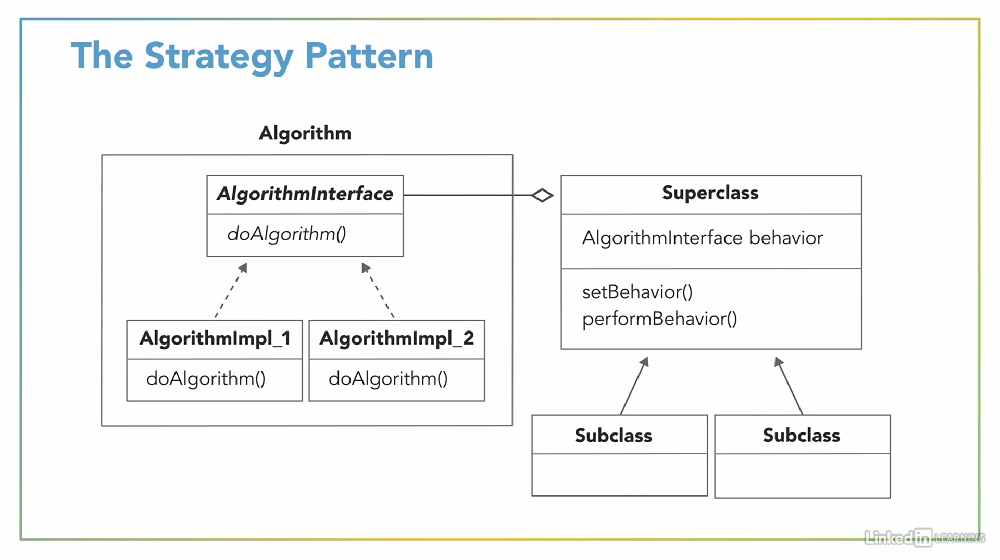
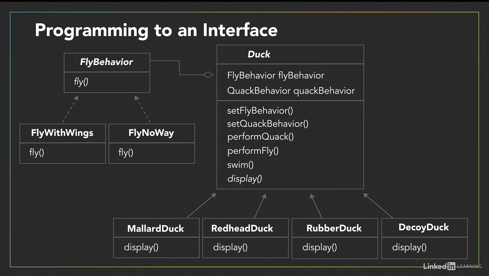
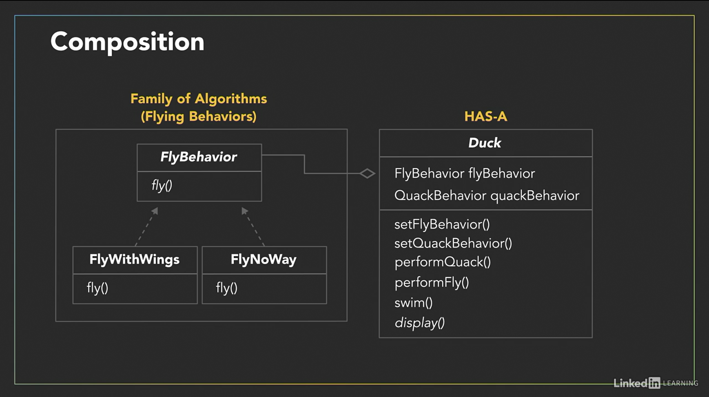

(Source: LinkedIn Learning Course of Programming Foundations- Design Patterns)

# About The Strategy Pattern

In this exercise, we use a pattern design by following the logic of "separate with varies". This strategy is called __The Strategy Pattern__. Here we follow the design principle "program for interface not for implementation".

## The Strategy Pattern
This pattern defines a family of patterns/algorithms, encapsulates each one, and makes them interchangeable. This lets the algorithm vary independently from client that use it.

## Programming To An Interface

## Advantages
- We are using Has-a relationship (composition) for FlyBehavior and QuackBehavior instead of Is-a relationship (inheritance).
- Instead of inheriting these behaviors, we are composing these behaviors.
- This provides more flexible design so we can easily use these behaviors rather than inheritance.
- In other words, if we use Is-a relationship (inheritance), we are locked into these behaviors during the run-time but this is not the case for Has-a relationship (composition).

## Design Principle
- Using composition rather than inheritance is important design principle because typically composition leads to more flexible design. 