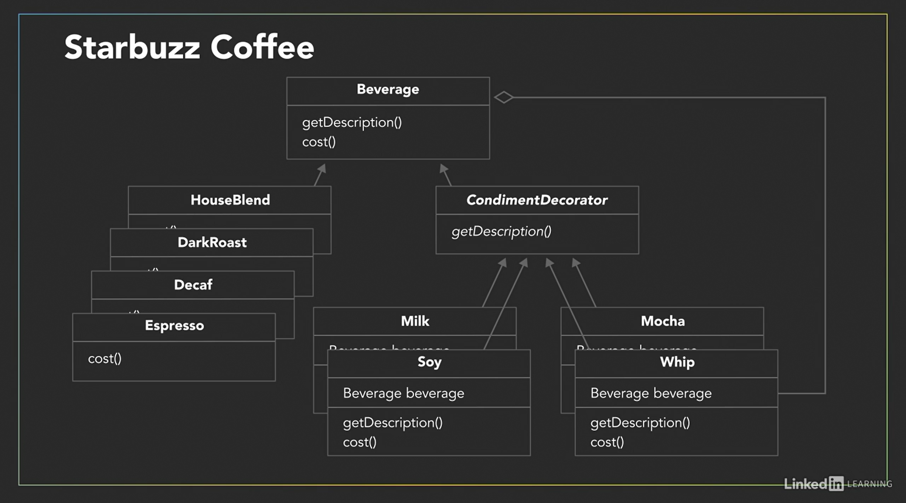

# The Decorator Pattern
This pattern attaches additional responsibilities to an object dynamically. Decorators provide a flexible alternative to subclasses for extending functionality.

## Principles: 
1. Here we also favor composition over inheritance. 
2. We use The open-close principle:
    - classes should be open to extensions of behavior.
    - classes should be closed to modification.

## Composition 
- components - abstract class (e.g. beverage).
     - concrete components (e.g. coffee, cappuccino). 
     - decorators - abstract class (e.g. additives)
         - concrete decorators (e.g. milk, soy, mocha, whip). 

## Problem 
- Coffee Shop that sells beverages.

